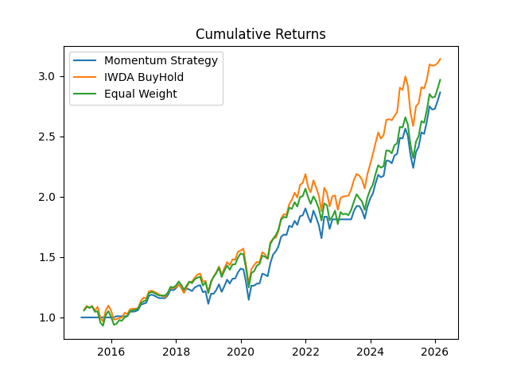
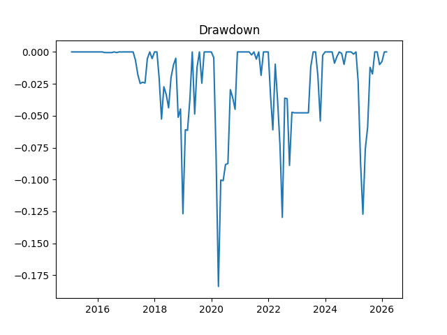

# Quantitative Momentum Strategy on European UCITS ETFs (Python)

## Overview

This project implements a quantitative time-series momentum strategy on UCITS ETFs listed on Euronext Amsterdam. The objective is to demonstrate quantitative investment research using Python, including financial data processing, signal construction, portfolio allocation, and performance evaluation.

The project builds a systematic investment strategy and compares its performance against benchmark portfolios.

This project was developed as part of my preparation for quantitative investing and asset management roles.

---

## Strategy Description

The investment strategy is based on time-series momentum.

Each month:

- ETFs with positive 12-month returns are selected
- Portfolio weights are assigned equally
- ETFs with negative momentum are excluded
- Portfolio is rebalanced monthly

Transaction costs are included using a turnover-based model.

---

## Assets

The strategy uses UCITS ETFs listed on Euronext Amsterdam:

- IWDA.AS – iShares Core MSCI World UCITS ETF
- CSPX.AS – iShares Core S&P 500 UCITS ETF
- IEMA.AS – iShares Core MSCI Emerging Markets IMI UCITS ETF

---

## Data

- Historical ETF prices downloaded using the yfinance Python library
- Daily data converted into monthly observations
- Monthly returns computed from price changes

Sample period:

2015 – 2026

---

## Methodology

### Momentum Signal

Momentum is calculated as:

12-month return excluding the most recent month (12-1 momentum)

Signal rule:

- Positive momentum → Invest
- Negative momentum → Allocate to cash

---

### Portfolio Construction

- Equal-weighted portfolio
- Monthly rebalancing
- Turnover-based transaction costs
- Realistic backtesting assumptions

---

## Benchmarks

Strategy performance is compared against:

1. IWDA Buy-and-Hold Portfolio
2. Equal-Weight Buy-and-Hold Portfolio

---

## Performance Metrics

The following metrics are calculated:

- Annualized Return
- Annualized Volatility
- Sharpe Ratio
- Maximum Drawdown
- CAPM Alpha
- CAPM Beta

Performance metrics are stored in:

performance_metrics.csv

---

## Results

The strategy produces stable long-term returns with moderate drawdowns.

Output charts include:

Cumulative Returns:

cumulative_returns.png

Drawdown:

drawdown.png

## Results

### Cumulative Returns

### Drawdown

---

## Project Structure
gs-quant-etf-momentum/
README.md
requirements.txt
notebooks/
01_backtest_tsmom_euronext.ipynb
outputs/
figures/
cumulative_returns.png
drawdown.png
tables/
performance_metrics.csv

---

## Tools Used

- pandas
- numpy
- matplotlib
- yfinance
- statsmodels

---

## Author

Zere Alnassirova  
MSc Finance – University of Amsterdam  
2026
